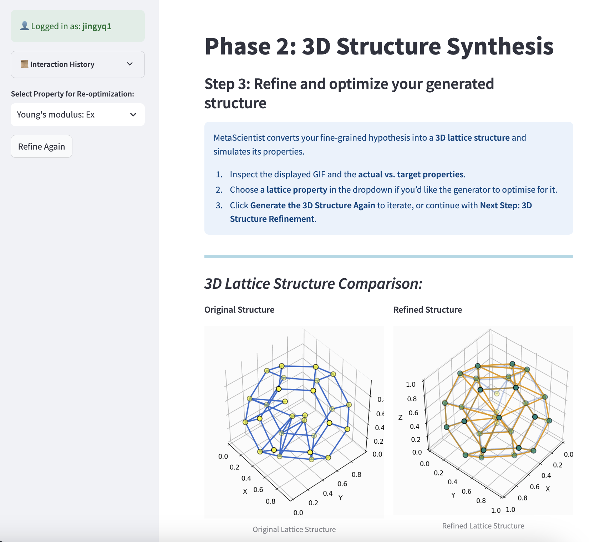

# MetaScientist

[](https://arxiv.org/abs/2412.16270)

## Overview

MetaScientist is a human-AI synergistic framework for automated mechanical metamaterial design. This repository contains the demo interface for the MetaScientist system, allowing users to interact with the framework through a web-based application.

The system accelerates the design of novel metamaterials through two primary phases:
1. **Hypothesis Generation**: Performs complex reasoning to generate novel and scientifically sound hypotheses, supported by domain-specific foundation models and inductive biases retrieved from existing literature.
2. **3D Structure Synthesis**: Synthesizes 3D structures with a novel diffusion model based on textual hypotheses and refines them with an LLM-based refinement model to achieve better structural properties.

## Demo Interface

This repository contains only the frontend demo interface of the MetaScientist system. The backend code and models are not included in this public repository.


### Demo Result


*Example of a 3D lattice structure generated by MetaScientist*

## Try the Demo

You can access the online demo of MetaScientist at: [here](http://zhoulab-1.cs.vt.edu:5557/)

## Documentation

For detailed instructions on how to use the MetaScientist demo interface, please refer to our [Wiki page](https://github.com/metascientist/MetaScientist/wiki/MetaScientist-User-Documentation).

## Citation

If you use MetaScientist in your research, please cite our paper:

```bibtex
@inproceedings{qi2025metascientist,
  title={MetaScientist: A Human-AI Synergistic Framework for Automated Mechanical Metamaterial Design},
  author={Qi, Jingyuan and Jia, Zian and Liu, Minqian and Zhan, Wangzhi and Zhang, Junkai and Wen, Xiaofei and Gan, Jingru and Chen, Jianpeng and Liu, Qin and Ma, Mingyu Derek and Li, Bangzheng and Wang, Haohui and Kulkarni, Adithya and Chen, Muhao and Zhou, Dawei and Li, Ling and Wang, Wei and Huang, Lifu},
  booktitle = "Proceedings of the 2025 Conference of the Nations of the Americas Chapter of the Association for Computational Linguistics: Human Language Technologies (System Demonstrations)",
  month = apr,
  year = "2025",
  address = "Albuquerque, New Mexico",
  publisher = "Association for Computational Linguistics",
  url = "https://aclanthology.org/2025.naacl-demo.34/",
  doi = "10.18653/v1/2025.naacl-demo.34",
  pages = "404--436",
  ISBN = "979-8-89176-191-9"
}
```

## License

This project is licensed under the MIT License - see the LICENSE file for details.
